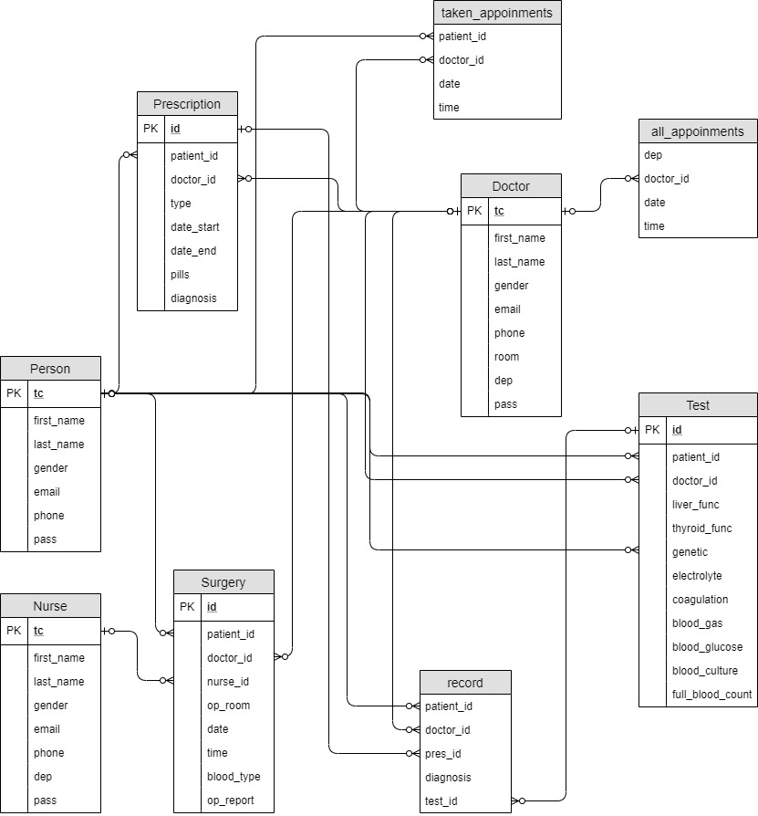

Developer Guide
===============

**E/R diagram**

**Database Initialization for HEROKU**

Since we are using Heroku for deployment, we need to set the database up accordingly. The code block below
descripes how our system is initialized. **DATABASE_URL** is inside the Heroku server and it is generated automatically
by Heroku. 

.. code-block:: python

   def initialize(url):
      with dbapi2.connect(url) as connection:
         cursor = connection.cursor()
         for statement in INIT_STATEMENTS:
               cursor.execute(statement)
         cursor.close()

   if __name__ == "__main__":
      url = os.getenv("DATABASE_URL")
      if url is None:
         print("Usage: DATABASE_URL=url python dbinit.py", file=sys.stderr)
         sys.exit(1)
      initialize(url)

.. toctree::

   seda
   buket
