User Guide
==========

**Welcome to MHRSAM user guide. Here, there will be information on 
how to use our application.**

1. Sign Up
--------

.. figure:: home_signup.png
   :scale: 40 %
   :alt: Home Page
   :align: center

   Home Page

Navigate to Register Page by clicking the *Sign Up* button on the top right
corner of the page.

.. figure:: signup.PNG
   :scale: 40 %
   :alt: Sign Up Page
   :align: center

   Sign Up Page

You should fill the necessary areas with the correct information. After that, click the 
*Sign Up* button and your account will be created. 

.. note:: You should use the correct tab (e.g. doctor tab if you are a doctor) when you are sign up.

.. figure:: redirect_login.png
   :scale: 40 %
   :alt: Sign Up Page
   :align: center

   Sign Up Page

If you already have an account you can access the Login Page by clicking the link below.

2. Login
-----

.. figure:: home_login.png
   :scale: 40 %
   :alt: Home Page
   :align: center

   Home Page

Navigate to Login Page by clicking the *Login* button on the top right
corner of the page.

.. figure:: login.PNG
   :scale: 40 %
   :alt: Login Page
   :align: center

   Login Page

You should fill the necessary areas with the correct information. After that, you can click the *Login* button to 
access your account. 

.. note:: You should use the correct tab (e.g. doctor tab if you are a doctor) when you login.

.. figure:: redirect_signup.png
   :scale: 40 %
   :alt: Login Page
   :align: center

   Login Page

If you don't have an account you can access the Signt Up Page by clicking the link below.

3. Account
-----------

You can access your account credentials by clicking *Account* button on the top right corner 
of the home page once you signed in. It will redirect you to your account page.

If you want to update your information, fill the areas you want to update then click the update button.

.. warning:: If you don't see a confirmation or error message try again.

If you want to delete your account simply click the delete account button on the top right corner of the page.

.. warning:: This action will delete all of your information and, is irreversable so you must be careful.

4. Patient
---------

4.1 Home
^^^^^^^^

This is your homepage. You can access various pages using links in this page.

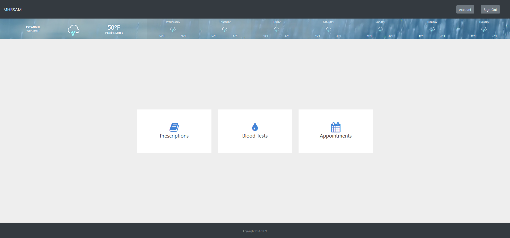

   Home Page

On your your home page you can see links to;
   * *Prescriptions*
   * *Tests*
   * *Appointments*        pages.

You can sign out by clicking *Sign Out* button on the top right corner of the page.

4.2 Prescriptions
^^^^^^^^^^^^^^^^^

You can access your prescriptions by simply clicking the *Prescriptions* link, then you will be redirected to the
Prescriptions page.

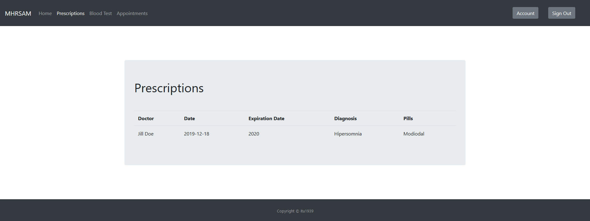

   Prescription Page

Here, you will see all the prescriptions written to you.

You can navigate through navigation bar to home or any other page.

4.3 Tests
^^^^^^^^^

You can access your test results by simply clicking the *Blood Tests* link, then you will be redirected to the
Blood Tests page.

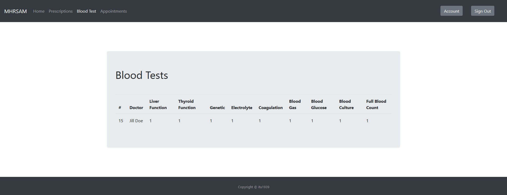

   Blood Test Page

Here, you will see all of your test results.

You can navigate through navigation bar to home or any other page.

4.4 Appointments
^^^^^^^^^^^^^^^^

If you want to make an appointment you can click to *Appointments* link to access the appoinment page. 

.. figure:: appo.png
   :scale: 40 %
   :alt: Appointments Page
   :align: center

   Appointments Page

Here, you will be recieving a form to make an appointment. Start making your appointment by selecting a department.

When you click the first form area it will show you all the departments that have an available doctor. 

After selecting a doctor, the third form area will be updated to show you all the available days for that doctor. Select a day that suits you.

After selecting a day, the final form area will be updated to show you the available times in that day. Select a time that suits you.

After selecting time click the *Submit* button and your appointment will be saved. 

.. warning:: After clicking the submit button you should see a affirmation message. If you see an error try again.

5. Doctor
---------

5.1 Home
^^^^^^^^

This is your homepage. You can access various pages using links in this page.

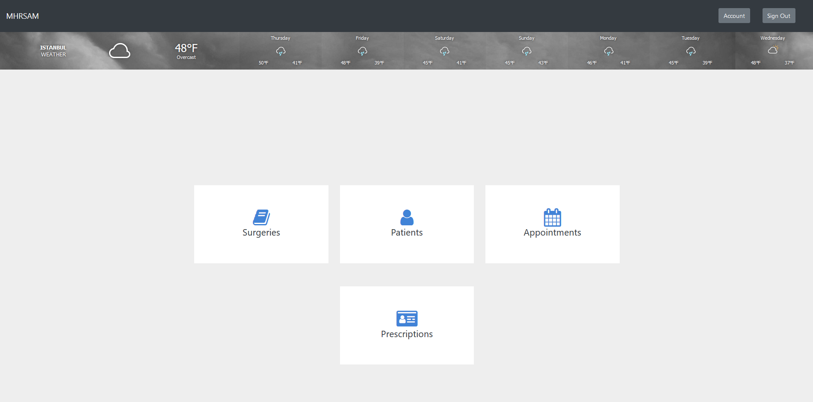

   Home Page

On your your home page you can see links to;

   * *Surgeries*
   * *Patients*
   * *Appointments* 
   * *Prescriptions*       pages.

You can sign out by clicking *Sign Out* button on the top right corner of the page.

5.2 Surgeries
^^^^^^^^^^^^^

You can access surgery page by simply clicking the *Surgeries* link.

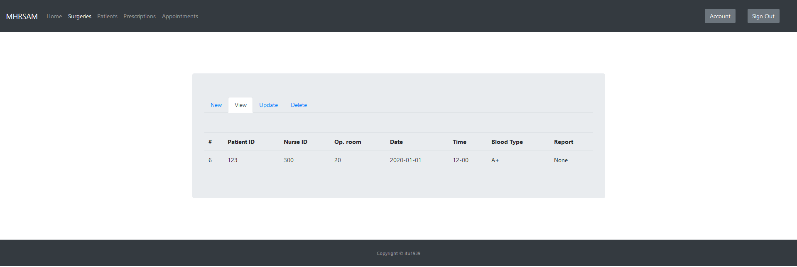

   Surgery Page

Here, you will see all the past and upcoming surgeries of your patients. 

You can add new surgeries by navigating through tabs to new surgery page. Fill the necessary information and click submit to add new surgery.

.. warning:: If you see an error message or don't see the confirmation message, it means surgery registration was unsuccessful and you should try again.

You can update existing surgery informations by navigating through tabs to update surgery page. Here, you will see a selection box. You should select the ID of the surgery you want to update. After that you will be directed to the page of the update form.
Fill the form with the correct informations and click the submit button.

.. note:: You must fill the the form entirely regardless if you want to change the information on that area or not, if you don't that area will be considered null and changed accordingly.

You can delete existing surgeries by navigating through tabs to delete surgery page. Here, select the ID of the surgery you want to delete and click submit button.

You can navigate through navigation bar to home or any other page.

5.3 Patients
^^^^^^^^^^^^

You can access your patients' informations by clicking *Patients* link.

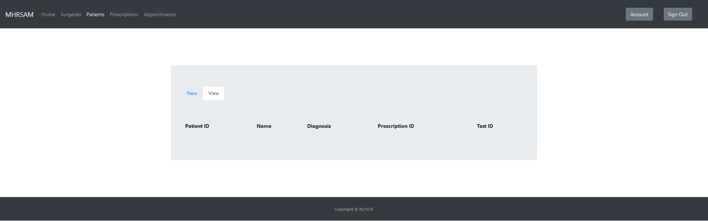

   Patient Page

To add a new patient, navigate through tabs to new patient page. Fill the necessary information and click submit button.

5.3 Prescriptions
^^^^^^^^^^^^^^^^^

You can access prescription page by simply clicking the *Prescriptions* link. Here, you can add a 
new prescription for your patient.

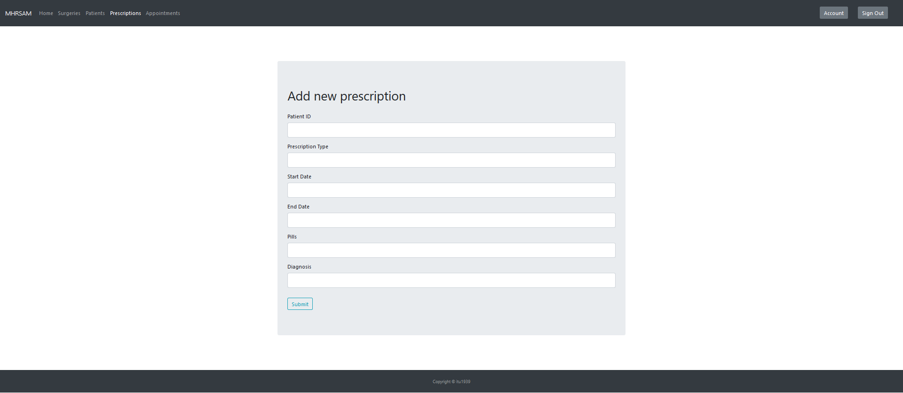

   Prescription Page

Fill the form with the correct information and click the submit button.

5.3 Appointments
^^^^^^^^^^^^^^^^

You can access appointments page by simply clicking the *Appointments* link.

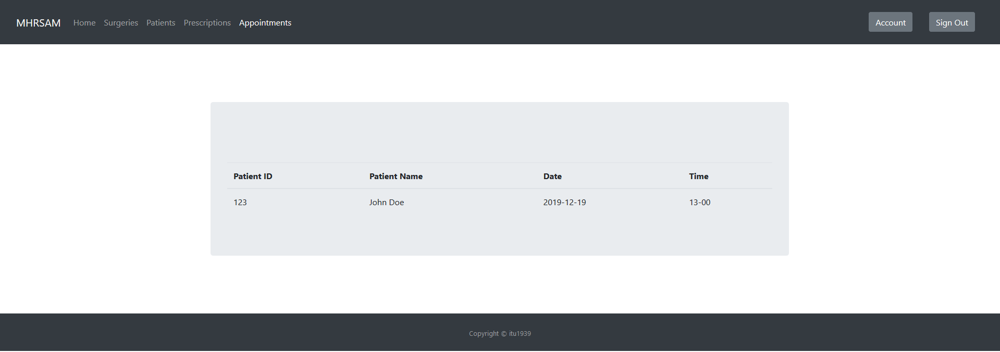

   Appointments Page

Here, you will see list of all the patients that took appointments from you and, date and times of that appointments.

6. Nurse
---------

6.1 Home
^^^^^^^^

This is your homepage. You can access various pages using links in this page.

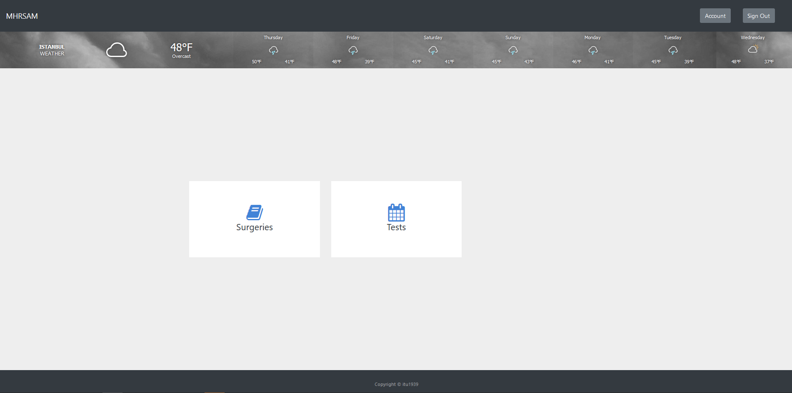

   Home Page

On your your home page you can see links to;

   * *Surgeries*
   * *Tests*      pages.

You can sign out by clicking *Sign Out* button on the top right corner of the page.

6.2 Surgeries
^^^^^^^^^^^^^

You can access surgery page by simply clicking the *Surgeries* link.

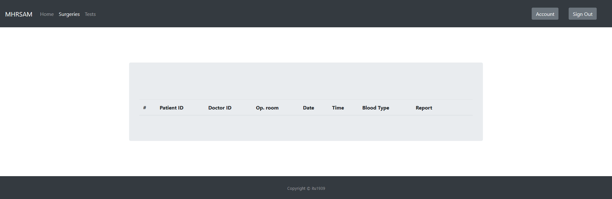

  Surgery Page

Here, you will see a list of all the surgeries you are assigned to.

You can navigate through navigation bar to home or any other page.

6.3 Tests
^^^^^^^^^

You can access test page by simply clicking the *Tests* link.

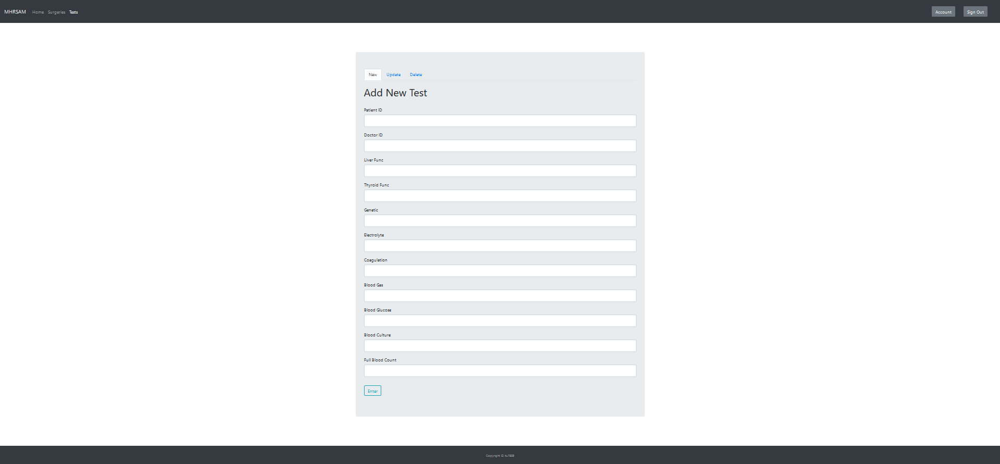

  Tests Page

Here, you can add the results of the patients blood tests to the system. Fill the form with correct information and click the *Enter* button.

You can update existing test results by navigating through tabs to update test page. Here, you will see a selection box. You should select the ID of the test you want to update. After that you will be directed to the page of the update form.
Fill the form with the correct informations and click the submit button.

.. note:: You must fill the the form entirely regardless if you want to change the information on that area or not, if you don't that area will be considered null and changed accordingly.

You can delete existing test results by navigating through tabs to delete test page. Here, select the ID of the test you want to delete and click submit button.
