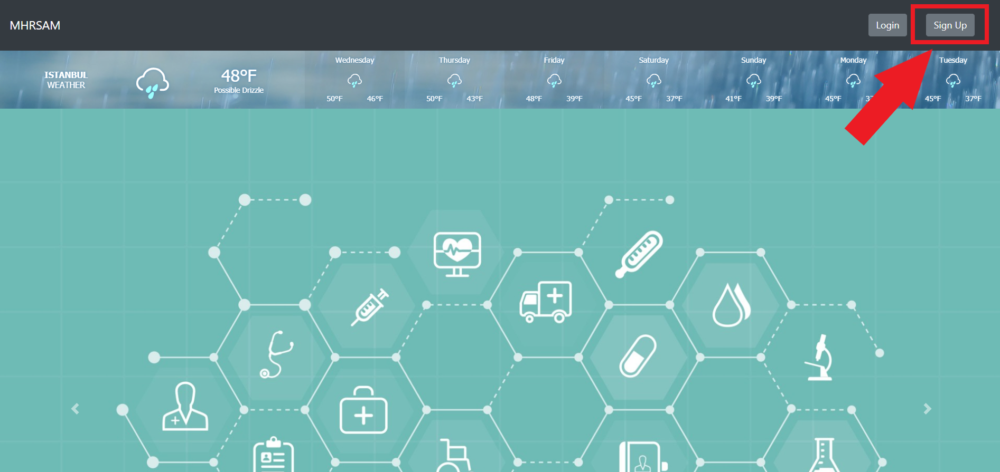
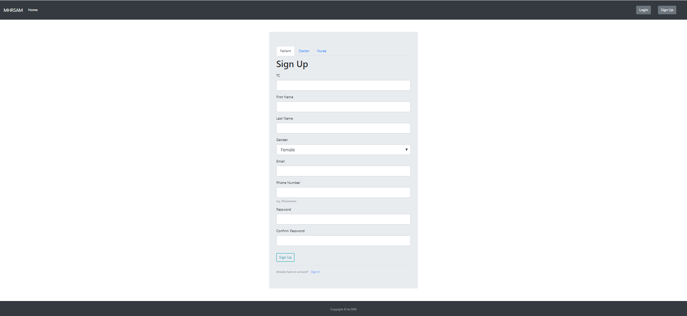
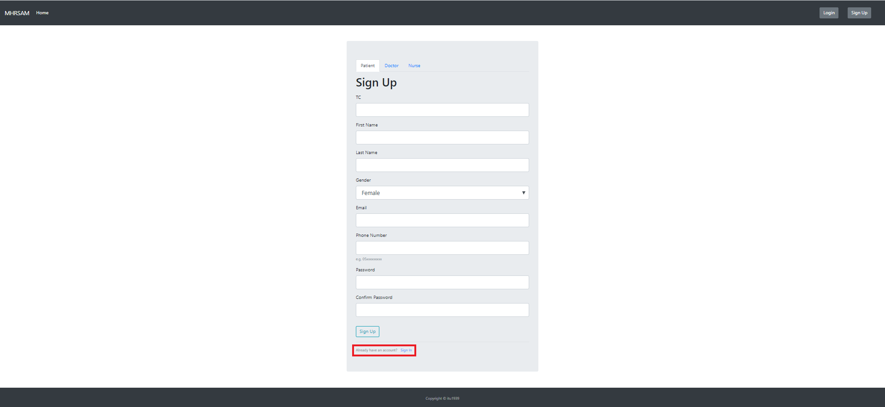
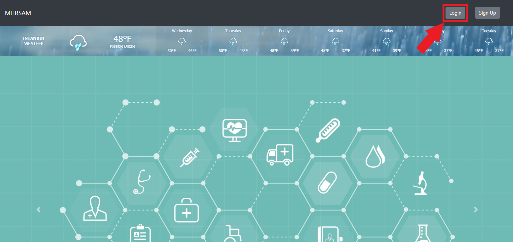
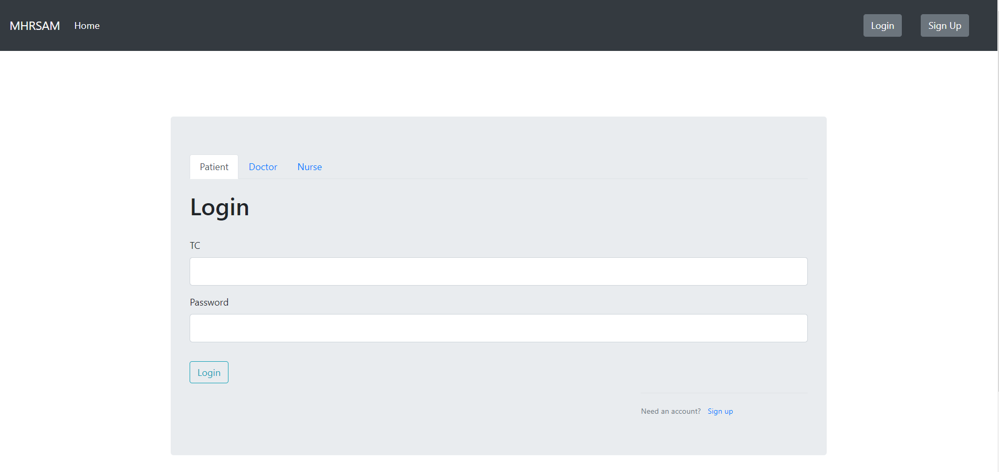
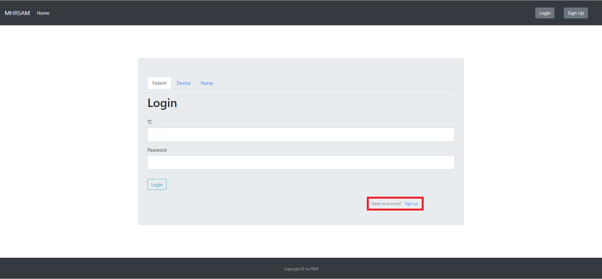

User Guide
==========

**Welcome to MHRSAM user guide. Here, there will be information on 
how to use our application.**

Sign Up
--------

   Home Page

Navigate to Register Page by clicking the *Sign Up* button on the top right
corner of the page.

   Sign Up Page

You should fill the necessary areas with the correct information. After that, click the 
*Sign Up* button and your account will be created. 

   Sign Up Page

If you already have an account you can access the Login Page by clicking the link below.

Login
-----

   Home Page

Navigate to Login Page by clicking the *Login* button on the top right
corner of the page.

   Login Page

You should fill the necessary areas with the correct information. After that, you can click the *Login* button to 
access your account. 

   Login Page

If you don't have an account you can access the Signt Up Page by clicking the link below.

PATIENT
-------
Home
^^^^
