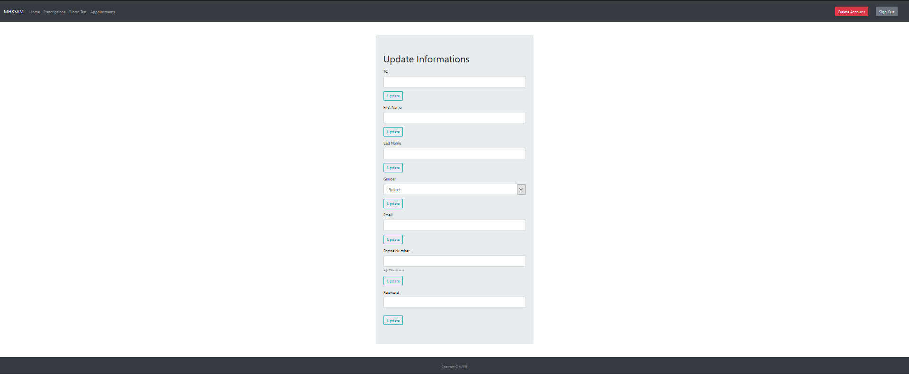

User Guide
==========

**Welcome to MHRSAM user guide. Here, there will be information on 
how to use our application.**

Sign Up
--------

.. figure:: home_signup.png
   :scale: 40 %
   :alt: Home Page
   :align: center

   Home Page

Navigate to Register Page by clicking the *Sign Up* button on the top right
corner of the page.

.. figure:: signup.PNG
   :scale: 40 %
   :alt: Sign Up Page
   :align: center

   Sign Up Page

You should fill the necessary areas with the correct information. After that, click the 
*Sign Up* button and your account will be created. 

.. figure:: redirect_login.png
   :scale: 40 %
   :alt: Sign Up Page
   :align: center

   Sign Up Page

If you already have an account you can access the Login Page by clicking the link below.

Login
-----

.. figure:: home_login.png
   :scale: 40 %
   :alt: Home Page
   :align: center

   Home Page

Navigate to Login Page by clicking the *Login* button on the top right
corner of the page.

.. figure:: login.PNG
   :scale: 40 %
   :alt: Login Page
   :align: center

   Login Page

You should fill the necessary areas with the correct information. After that, you can click the *Login* button to 
access your account. 

.. figure:: redirect_signup.png
   :scale: 40 %
   :alt: Login Page
   :align: center

   Login Page

If you don't have an account you can access the Signt Up Page by clicking the link below.

1.Patient
---------

1.1 Home
^^^^^^^^

This is your homepage. You can access various pages using links in this page.

.. figure:: home_patient.PNG
   :scale: 40 %
   :alt: Home_P Page
   :align: center

   Home Page

On your your home page you can see links to;
   * *Prescriptions*
   * *Tests*
   * *Appointments*        pages.

You can sign out by clicking *Sign Out* button on the top right corner of the page.

1.2 Account
^^^^^^^^^^^
You can access your account credentials by clicking *Account* button on the top right corner of the page. It will redirect you to your account page.

   Home Page

If you want to update your information, fill the areas you want to update then clcik the update button.

.. warning:: If you don't see a confirmation message or error message try again.

If you want to delete your account simply click the delete account button on the top right corner of the page.

.. warning:: This action will delete all of your information and, is irreversable so you must be careful.

1.3 Prescriptions
^^^^^^^^^^^^^^^^^

You can access your prescriptions by simply clicking the *Prescriptions* link, then you will be redirected to the
Prescriptions page.

.. figure:: pres_p.PNG
   :scale: 40 %
   :alt: Prescription Page
   :align: center

   Prescription Page

Here, you will see all the prescriptions written to you.

You can navigate through navigation bar to home or any other page.

1.4 Tests
^^^^^^^^^

You can access your test results by simply clicking the *Blood Tests* link, then you will be redirected to the
Blood Tests page.

.. figure:: test.PNG
   :scale: 40 %
   :alt: Test Page
   :align: center

   Blood Test Page

Here, you will see all of your test results.

You can navigate through navigation bar to home or any other page.

1.5 Appointments
^^^^^^^^^^^^^^^^

If you want to make an appointment you can click to *Appointments* link to access the appoinment page. 

.. figure:: appo.png
   :scale: 40 %
   :alt: Appointments Page
   :align: center

   Appointments Page

Here, you will be recieving a form to make an appointment. Start making your appointment by selecting a department.

When you click the first form area it will show you all the departments that have an available doctor. 

After selecting a doctor, the third form area will be updated to show you all the available days for that doctor. Select a day that suits you.

After selecting a day, the final form area will be updated to show you the available times in that day. Select a time that suits you.

After selecting time click the *Submit* button and your appointment will be saved. 

.. warning:: After clicking the submit button you should see a affirmation message. If you see an error try again.

